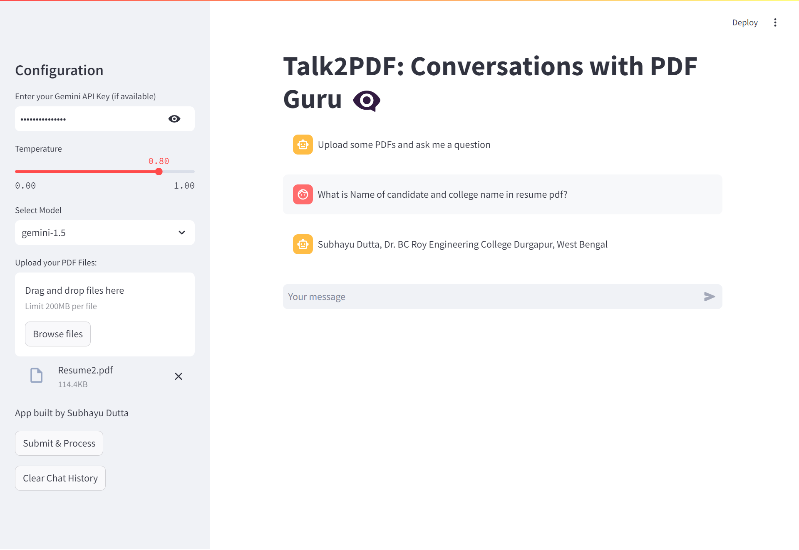

# Talk2PDF

Chat with multiple PDFs using Google's Generative AI Gemini 1.5 pro and LangChain.

Visit the live app: [Talk2PDF](https://talk2pdf-sd.streamlit.app/)

## Features

- Chat with multiple PDFs simultaneously.
- Developed by using Google's Generative AI Gemini 1.5 pro and LangChain.
- Secure and private conversations with AI-powered language capabilities.
- User-friendly interface for an intuitive chatting experience.

## Usage

1. Visit the [Talk2PDF website](https://talk2pdf-sd.streamlit.app/).
2. Upload the pdf you want to chat with.
3. Enter your messages.
4. Chat with multiple PDFs using the power of generative AI.

## Installation

You don't need to install anything to use Talk2PDF. Just visit the website and start chatting!

