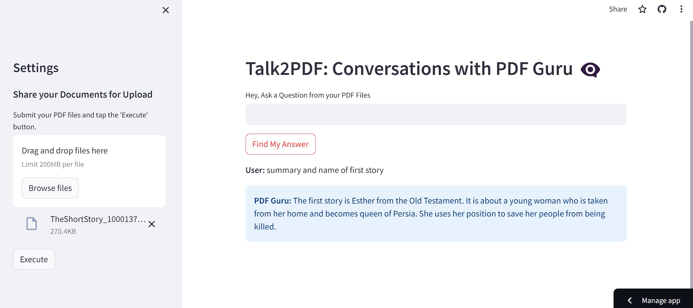

# Talk2PDF

Chat with multiple PDFs using Google's Generative AI Palm 2 and LangChain.

Visit the live app: [Talk2PDF](https://your-tal2pdf-website-url.com/)

## API Key

To use Talk2PDF, you need an API key from Google's Generative AI Palm 2. 
Visit [Generative AI - PALM](https://developers.generativeai.google/products/palm) to get your API key.

## Features

- Chat with multiple PDFs simultaneously.
- Developed by using Google's Generative AI Palm 2 and LangChain.
- Secure and private conversations with AI-powered language capabilities.
- User-friendly interface for an intuitive chatting experience.

## Usage

1. Visit the [Talk2PDF website](https://your-tal2pdf-website-url.com/).
2. Get your API key from [Generative AI - PALM](https://developers.generativeai.google/products/palm).
3. Enter your API key in the app settings.
4. Chat with multiple PDFs using the power of generative AI.

## Installation

You don't need to install anything to use Talk2PDF. Just visit the website and start chatting!

